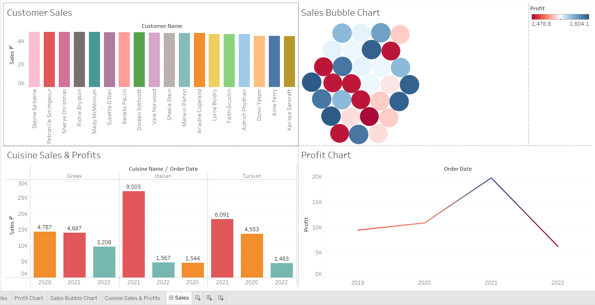

This is my Capstone Project for the Meta Data Engineering Certificate Program

The purpose of this project was to help a fictional restaurant called Little Lemon with their database needs.
This entailed creating an ER Diagram and Data Model to show the necessary tables and relationships to help them organize and manage their operations.

 

The next step of the Project was to forward engineer the Data Model into a SQL Schema and build the database.

 <-Click to view code!

Next I had to set them up with some SQL Queries to show sales reports for the restaurant. This was done by making use of Views, Joins, Subqueries, Stored Procedures, and Prepared Statements.

 <-Click to view code!

After that I created more useful Stored Procedures to help the restaurant with managing reservations. This included procedures for checking the reservation status of a table, adding a new reservation, Utilizing transactions to rollback changes if the reservation added conflicted with a reservation already in the table, and a procedure to cancel a reservation. All of these with outputs to let the user know the outcome of the procedure.

 <-Click to view code!

The next task was to create some Data Visualizations in Tableau to illustrate sales and profits data as they relate to specific customers or cuisines, along with changes over time.

The final part of the project was to use MySQL-Connector-Python to setup a database client so Little Lemon is able to use a Python application to interact with the database. This included creating a cursor object to query the database and retrieving the data from the cursor object.

 <-Click to view code!

THANK YOU for taking the time to look through my project!
