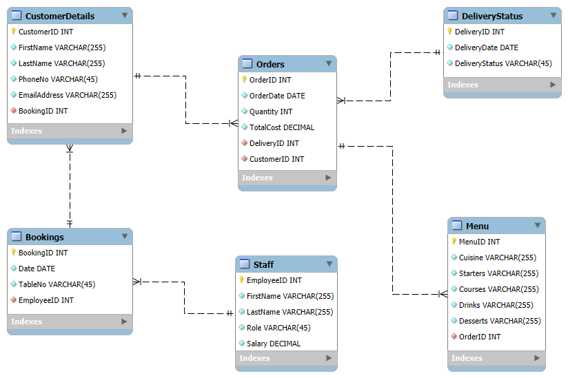

This is my Capstone Project for the Meta Data Engineering Certificate Program

The purpose of this project was to help a fictional restaurant called Little Lemon with their database needs.
This entailed creating an ER Diagram and data model to show the necessary tables and relationships to help them organize and manage bookings.

 

